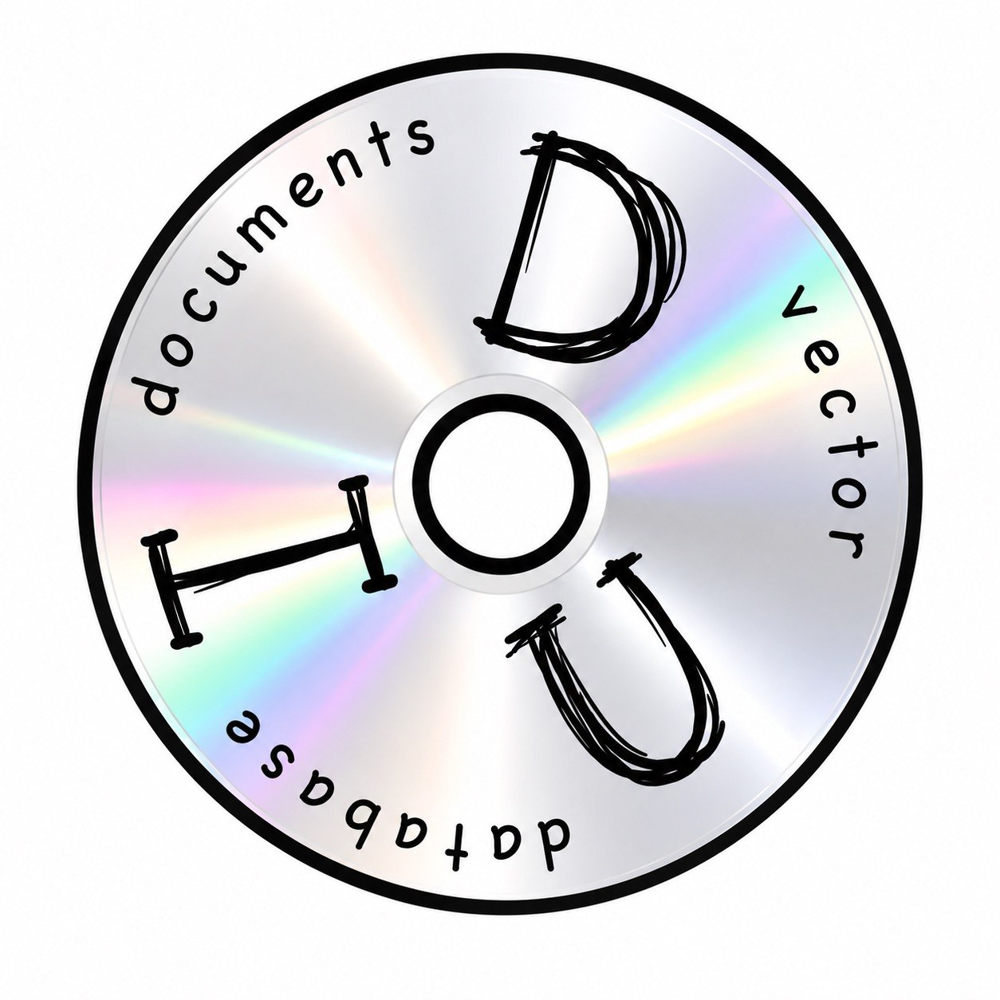

<p align="center">
  
</p>

<h1 align="center">DVD IDU</h1>

<p align="center">
  Сервис подготовки, структурирования и векторной индексации нормативных документов
  с семантическим поиском.
</p>

<p align="center">
  <a href="README.md">English</a> · <b>Русский</b>
</p>

---

## Назначение

Приложение принимает нормативный документ (формат `.docx`), восстанавливает его логическую
структуру с помощью большой языковой модели, разбивает на смысловые фрагменты, векторизует их
и сохраняет в Qdrant с подробными метаданными (тип структурного элемента, нумерация, иерархия,
версия документа, теги, ссылки на соседние фрагменты). На основе индекса предоставляется
векторный поиск по тексту и по таблицам с фильтрами и сборкой контекста заданной ширины.

Сервис ведёт версии документов и отклоняет точные дубликаты, а таблицы хранит отдельными
сущностями.

## Возможности

- Разбор `.docx` и восстановление логических частей документа (склейка разорванных абзацев,
  выделение пунктов и подпунктов).
- Разметка структуры LLM: тип элемента, собственная нумерация, относительная глубина, признак
  изменения (поправки).
- Построение иерархии документа (разделы, пункты, подпункты) и развёртка в плоские узлы со
  ссылками на родителя, детей и соседние фрагменты по порядку чтения.
- Автоматическое определение названия и версии документа.
- Тегирование фрагментов.
- Извлечение и резолв ссылок между документами/пунктами (на пункты других документов или на
  пункты внутри того же документа), с очередью отложенных ссылок, которая резолвится сама, когда
  упомянутый документ загружается позже.
- Векторизация эмбеддинг-моделью и загрузка в Qdrant.
- Векторный поиск по текстам и по таблицам с фильтрами (название, версия, блок, структурный
  уровень, теги) и параметром ширины контекста.
- Список документов (агрегированный по названию + версии) с метаданными — число узлов,
  присутствующие блоки, объединение тегов, время загрузки — и фильтрами (название, версия, блок,
  теги, диапазон времени загрузки).
- Дедупликация по полному тексту и версионирование с перечнем других версий документа в базе.
- Хранение статусов фоновой обработки в Redis.

## Требования

- Python `>=3.11,<3.14`.
- [uv](https://docs.astral.sh/uv/) для управления зависимостями.
- Qdrant (векторная база).
- Redis (статусы задач и реестр документов/версий).
- Ollama с двумя моделями:
  - LLM для разметки, мерджа, тегов и определения версии;
  - эмбеддинг-модель (по умолчанию `bge-m3`, размерность вектора 1024).
- Docker и Docker Compose — опционально, для запуска инфраструктуры и приложения в контейнерах.

Системные библиотеки OCR (poppler, tesseract) для `.docx` не требуются: разбор идёт через
`partition_docx` (python-docx), без тяжёлых бэкендов.

## Развёртывание

### 1. Инфраструктура

```
docker compose up -d qdrant redis
```

Поднимает Qdrant (`:6333`) и Redis (`:6379`) с томами данных.

### 2. Модели Ollama

Эмбеддинг-модель обязательна, LLM — по вашему выбору (см. `docs/ru/configuration.md`):

```
ollama pull bge-m3
ollama pull qwen2.5:7b-instruct
```

### 3. Конфигурация

Скопируйте пример и при необходимости поправьте адреса и модели:

```
cp .env.example .env
```

Переменные имеют префикс `DVD_`. Размерность `DVD_VECTOR_SIZE` должна совпадать с размерностью
эмбеддинг-модели (`bge-m3` = 1024). Полный перечень — в `docs/ru/configuration.md`.

### 4. Запуск приложения

```
uv sync
uv run python -m src.dev_runner
```

Документация API (Swagger) доступна на `http://localhost:8000/docs`.

### Запуск приложения в Docker

В репозитории есть `Dockerfile` и сервис `app` в `docker-compose.yaml`:

```
docker compose up -d --build
```

Адреса Qdrant, Redis и Ollama для контейнера задаются переменными окружения в
`docker-compose.yaml`.

## Документация

- `docs/ru/architecture.md` — архитектура, модули и классы, модель данных.
- `docs/ru/pipeline.md` — конвейер обработки документа по этапам, дедупликация, версионирование.
- `docs/ru/api.md` — эндпоинты, форматы запросов и ответов, примеры.
- `docs/ru/configuration.md` — переменные окружения и рекомендации по моделям.

Английская версия: [`README.md`](README.md) и `docs/en/`.

## Статус

Базовый конвейер реализован и проверен сквозным прогоном на реальном нормативном документе
(СП 19.13330.2019) с локальной Ollama. Поддерживается только формат `.docx`; поддержка других
форматов планируется.
